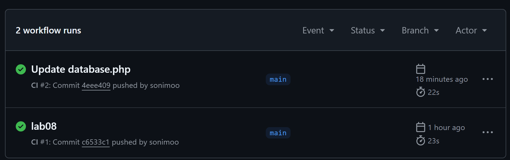

# Лабораторная работа №8. Непрерывная интеграция с помощью Github Actions
 
 - **Калинкова София, I2302** 
 - **20.04.2025** 

## Цель работы

В рамках данной работы студенты научатся настраивать непрерывную интеграцию с помощью Github Actions.

## Задание

Создать Web приложение, написать тесты для него и настроить непрерывную интеграцию с помощью Github Actions на базе контейнеров.

## Описание выполнения работы с ответами на вопросы

### Подготовка

установленный на компьютере Docker.

### Выполнение

Создаю репозиторий `containers08` и клонирую его себе на компьютер.

#### Создание Web приложения

Создайте в директории `./site` Web приложение на базе PHP со следующей структурой:

```
site
├── modules/
│   ├── database.php
│   └── page.php
├── templates/
│   └── index.tpl
├── styles/
│   └── style.css
├── config.php
└── index.php
```

Файл `modules/database.php` содержит класс Database для работы с базой данных. Класс должен содержать методы:

- `__construct($path)` - конструктор класса, принимает путь к файлу базы данных SQLite;
- `Execute($sql)` - выполняет SQL запрос;
- `Fetch($sql)` - выполняет SQL запрос и возвращает результат в виде ассоциативного массива.
- `Create($table, $data)` - создает запись в таблице $table с данными из ассоциативного массива $data и возвращает идентификатор созданной записи;
- `Read($table, $id)` - возвращает запись из таблицы $table по идентификатору $id;
- `Update($table, $id, $data)` - обновляет запись в таблице $table по идентификатору $id данными из ассоциативного массива $data;
- `Delete($table, $id)` - удаляет запись из таблицы $table по идентификатору $id.
- `Count($table)` - возвращает количество записей в таблице $table.

```php
<?php

class Database {
    private $pdo;

    public function __construct($path) {
        try {
            $this->pdo = new PDO("sqlite:" . $path);
            $this->pdo->setAttribute(PDO::ATTR_ERRMODE, PDO::ERRMODE_EXCEPTION);
        } catch (PDOException $e) {
            die("Ошибка подключения к базе данных: " . $e->getMessage());
        }
    }

    public function Execute($sql) {
        return $this->pdo->exec($sql);
    }

    public function Fetch($sql) {
        $stmt = $this->pdo->query($sql);
        return $stmt->fetchAll(PDO::FETCH_ASSOC);
    }

    public function Create($table, $data) {
        $columns = implode(", ", array_keys($data));
        $placeholders = implode(", ", array_map(fn($k) => ":$k", array_keys($data)));
        $stmt = $this->pdo->prepare("INSERT INTO $table ($columns) VALUES ($placeholders)");
        $stmt->execute($data);
        return $this->pdo->lastInsertId();
    }

    public function Read($table, $id) {
        $stmt = $this->pdo->prepare("SELECT * FROM $table WHERE id = :id");
        $stmt->execute(["id" => $id]);
        return $stmt->fetch(PDO::FETCH_ASSOC);
    }

    public function Update($table, $id, $data) {
        $set = implode(", ", array_map(fn($k) => "$k = :$k", array_keys($data)));
        $data["id"] = $id;
        $stmt = $this->pdo->prepare("UPDATE $table SET $set WHERE id = :id");
        return $stmt->execute($data);
    }

    public function Delete($table, $id) {
        $stmt = $this->pdo->prepare("DELETE FROM $table WHERE id = :id");
        return $stmt->execute(["id" => $id]);
    }

    public function Count($table) {
        $stmt = $this->pdo->query("SELECT COUNT(*) FROM $table");
        return $stmt->fetchColumn();
    }
}
```

Файл `modules/page.php` содержит класс `Page` для работы с страницами. Класс должен содержать методы:

- __construct($template) - конструктор класса, принимает путь к шаблону страницы;
- Render($data) - отображает страницу, подставляя в шаблон данные из ассоциативного массива $data.


```php
<?php

class Page {
    private $template;

    public function __construct($template) {
        $this->template = file_get_contents($template);
    }

    public function Render($data) {
        $output = $this->template;
        foreach ($data as $key => $value) {
            $output = str_replace("{{ $key }}", htmlspecialchars($value), $output);
        }
        return $output;
    }
}

```

Файл `templates/index.tpl` содержит шаблон страницы.


```tpl
<!DOCTYPE html>
<html lang="en">
<head>
    <meta charset="UTF-8">
    <title>{{ title }}</title>
    <link rel="stylesheet" href="/styles/style.css">
</head>
<body>
    <div class="container">
        <h1>{{ title }}</h1>
        <p>{{ content }}</p>
    </div>
</body>
</html>
```

Файл `styles/style.css` содержит стили для страницы.

```css
body {
    font-family: Arial, sans-serif;
    margin: 0;
    padding: 20px;
    background-color: #f2f2f2;
}

.container {
    background: white;
    padding: 20px;
    border-radius: 8px;
    box-shadow: 0 0 10px rgba(0, 0, 0, 0.1);
}
```

Файл `index.php` содержит код для отображения страницы. 

```php
<?php

require_once __DIR__ . '/modules/database.php';
require_once __DIR__ . '/modules/page.php';
require_once __DIR__ . '/config.php';

$db = new Database($config["db"]["path"]);
$page = new Page(__DIR__ . '/templates/index.tpl');

$pageId = $_GET['page'] ?? 1;

$data = $db->Read("page", $pageId);

echo $page->Render($data);

```

Файл `config.php` содержит настройки для подключения к базе данных.

```php
<?php

$config = [
    "db" => [
        "path" => "/var/www/db/db.sqlite"
    ]
];
```


#### Подготовка SQL файла для базы данных

Создаю в корневом каталоге директорию `./sql`. В созданной директории создайте файл `schema.sql` со следующим содержимым:

```sql
CREATE TABLE page (
    id INTEGER PRIMARY KEY AUTOINCREMENT,
    title TEXT,
    content TEXT
);

INSERT INTO page (title, content) VALUES ('Page 1', 'Content 1');
INSERT INTO page (title, content) VALUES ('Page 2', 'Content 2');
INSERT INTO page (title, content) VALUES ('Page 3', 'Content 3');
```


#### Создание тестов

Создаю в корневом каталоге директорию `./tests`. В созданном каталоге создайте файл `testframework.php` со следующим содержимым:

```php
<?php

function message($type, $message) {
    $time = date('Y-m-d H:i:s');
    echo "{$time} [{$type}] {$message}" . PHP_EOL;
}

function info($message) {
    message('INFO', $message);
}

function error($message) {
    message('ERROR', $message);
}

function assertExpression($expression, $pass = 'Pass', $fail = 'Fail'): bool {
    if ($expression) {
        info($pass);
        return true;
    }
    error($fail);
    return false;
}

class TestFramework {
    private $tests = [];
    private $success = 0;

    public function add($name, $test) {
        $this->tests[$name] = $test;
    }

    public function run() {
        foreach ($this->tests as $name => $test) {
            info("Running test {$name}");
            if ($test()) {
                $this->success++;
            }
            info("End test {$name}");
        }
    }

    public function getResult() {
        return "{$this->success} / " . count($this->tests);
    }
}
```


Создаю в директории `./tests` файл `tests.php` со следующим содержимым:

```php
<?php

require_once __DIR__ . '/testframework.php';

require_once __DIR__ . '/../config.php';
require_once __DIR__ . '/../modules/database.php';
require_once __DIR__ . '/../modules/page.php';

$testFramework = new TestFramework();

// test 1: check database connection
function testDbConnection() {
    global $config;
    // ...
}

// test 2: test count method
function testDbCount() {
    global $config;
    // ...
}

// test 3: test create method
function testDbCreate() {
    global $config;
    // ...
}

// test 4: test read method
function testDbRead() {
    global $config;
    // ...
}

// add tests
$tests->add('Database connection', 'testDbConnection');
$tests->add('table count', 'testDbCount');
$tests->add('data create', 'testDbCreate');
// ...

// run tests
$tests->run();

echo $tests->getResult();
```

#### Создание Dockerfile


Создаю в корневом каталоге файл `Dockerfile` со следующим содержимым:

```Dockerfile
FROM php:7.4-fpm as base

RUN apt-get update && \
    apt-get install -y sqlite3 libsqlite3-dev && \
    docker-php-ext-install pdo_sqlite

VOLUME ["/var/www/db"]

COPY sql/schema.sql /var/www/db/schema.sql

RUN echo "prepare database" && \
    cat /var/www/db/schema.sql | sqlite3 /var/www/db/db.sqlite && \
    chmod 777 /var/www/db/db.sqlite && \
    rm -rf /var/www/db/schema.sql && \
    echo "database is ready"

COPY site /var/www/html
```

#### Настройка Github Actions

Создаю в корневом каталоге репозитория файл `.github/workflows/main.yml` со следующим содержимым:

```yml
name: CI

on:
  push:
    branches:
      - main

jobs:
  build:
    runs-on: ubuntu-latest
    steps:
      - name: Checkout
        uses: actions/checkout@v4
      - name: Build the Docker image
        run: docker build -t containers08 .
      - name: Create `container`
        run: docker create --name container --volume database:/var/www/db containers08
      - name: Copy tests to the container
        run: docker cp ./tests container:/var/www/html
      - name: Up the container
        run: docker start container
      - name: Run tests
        run: docker exec container php /var/www/html/tests/tests.php
      - name: Stop the container
        run: docker stop container
      - name: Remove the container
        run: docker rm container

```

#### Запуск и тестирование

Отправляю изменения в репозиторий и убеждаюсь, что тесты проходят успешно. Для этого перехожу во вкладку Actions в репозитории и дождавшись окончания выполнения задачи, вижу, что там зеление галочки :).




## Вывод

В ходе лабораторной работы было разработано веб-приложение на PHP с использованием SQLite. Реализована работа с базой данных через PDO, поддерживаются основные операции: добавление, чтение, обновление, удаление и подсчет записей. Проект организован по модулям, ошибки при подключении и выполнении SQL-запросов обрабатываются с выводом понятного сообщения. Код загружен на GitHub, протестирован с помощью GitHub Actions — оба теста прошли успешно.


